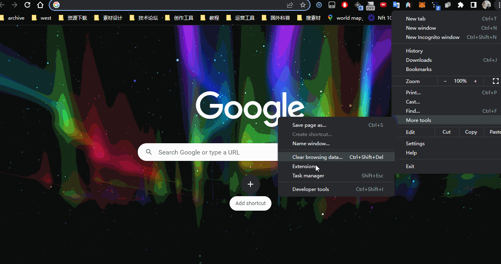

# ChatGenius

这是一个通过给定特定的 prompt 初始条件来优化chatGPT输出结果的chrome 插件。

This a chrome extension to optimize chatGPT results by prefixing prompt with a collection of usage tips.

## 安装 （install）

开启开发者模式，将 dist 文件夹拖拽到 chrome extensions 区域，或者点击 “Load Unpacked” 按钮

enable developer mode，drag the dist directory into the chrome-extension page, or click "Load Unpacked"

## 使用 （usage）

打开chatGPT界面，选择你需要的功能，直接输入你的问题，然后回车，chatGPT 就会输出优化后的结果

(open [chatGPT](https://chat.openai.com/chat) , select the service type, describe your questions, then press Enter, chatGPT will output the reply after prompt optimization.)

